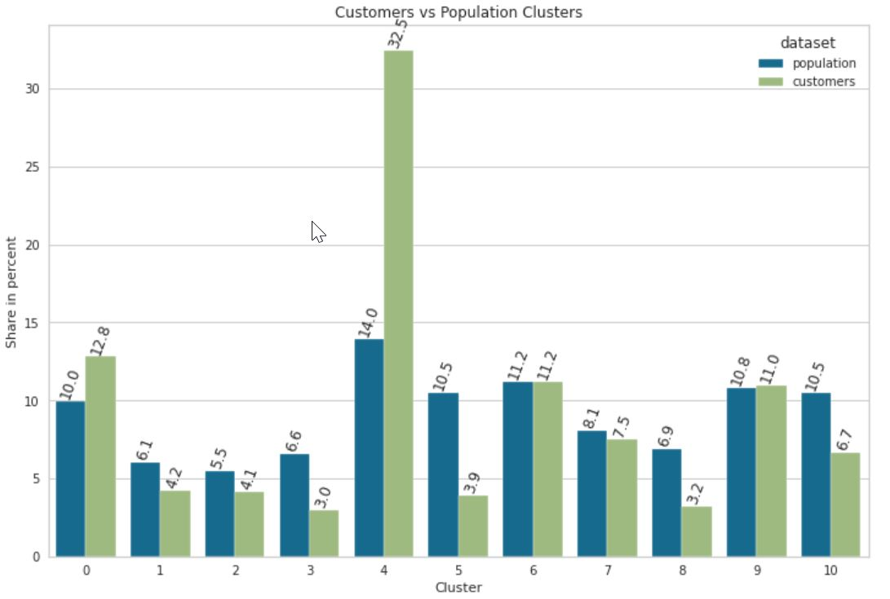
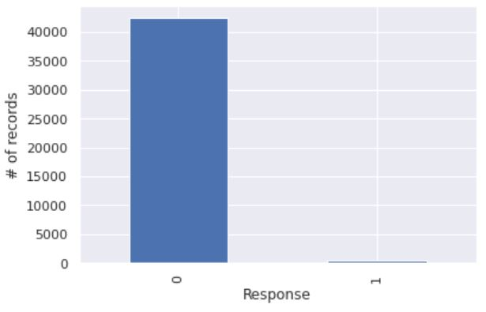

# Create a Customer Segmentation Report for Arvato Financial Solutions


Udacity DataScience Nanodegree Capstone Project Create a *Customer Segmentation Report for Arvato Financial Solutions*

## Background


Arvato Financial Services is a company operating in the mail-order sales business in Germany. The company wants better identify persons that become more likly customers with their marketing campaigns.

## Project Overview


In this project, we will analyze demographics data for customers of Arvato a mail-order sales company in Germany, comparing it against demographics information for the general population. 

We will use unsupervised learning techniques to perform customer segmentation, identifying the parts of the population that best describe the core customer base of the company. Then, we'll apply what we've learned on a third dataset with demographics information for targets of a mail order campaign.

## Results
see [Project Blog](https://stephan-bauer.medium.com/customer-segmentation-report-for-arvato-financial-services-882893203e8e)

## Table of Contents


* **Arvato Project Workbook.ipynb**: Main file - The Project jupyter notebook containing all the code and analysis.

    This made of 3 main parts

     1. Load and exploration and cleaning of data
     1. Unsupervised learning: Clustering of Population and Customers with PCA and KMeans
     1. Supervised Learning: Building of a ML Model to predict the probability that a given individual will become a customer
* Final_Report.pdz: Final Project Report
* Python: Folder of source code used for the analysis - mainly helper functions for data cleaning and visual plots

## Installation


As a pre-requisite to  install the needed environment you need [anaconda](https://docs.anaconda.com/anaconda/install/index.html).

You can then run the following command 

```bash
conda env create --file conda_environment.yml
```

### Data Download
Download project data from udacity workspace and store them in **dsnd_capstone_arvato/data/**. Required files are:

* DIAS Attributes - Values 2017.csv
* DIAS Information Levels - Attributes 2017.csv metadata that describes the used features of the data files
* Udacity_AZDIAS_052018.csv: general population
* Udacity_CUSTOMERS_052018.csv: customer data
* Udacity_MAILOUT_052018_TRAIN.csv: training data of the mailout campaign with Label information 
* Udacity_MAILOUT_052018_TEST.csv : test data of the mailout campaign without Label information -> used for Kaggle competition


## Used Libraries


The main libraries used are

 - pandas=1.3.2: [Data Structure and Analysis](https://pandas.pydata.org/docs/index.html#)
 - scikit-learn=0.24.2: [Python Machine Learning ](https://scikit-learn.org/stable/)
 - matplotlib=3.4.3 (Visualization with Python)[https://matplotlib.org/]
 -  seaborn=0.11.2 (statistical data visualization)[https://seaborn.pydata.org/]
 - py-xgboost=1.4.2 (Python XGBoost)[https://anaconda.org/anaconda/py-xgboost]
 - imbalanced-learn=0.8.0 (Random forrest for imbalanced data sets )[https://imbalanced-learn.org/stable/]
 - yellowbrick=1.3.post1 (Machine Learning Visualization)[https://www.scikit-yb.org/en/latest/api/cluster/elbow.html]
 
 ## Results


Details of the analysis are in the Final Project Report and the main project jupyter workbook. Below are a short summary of the main findings.

### Clustering

The segmentation of general population and customers shows that there a great differences between customers and general population for some clusters. For n=11 clusters we receive the following result:

 

This shows that the company's  customers are highly overrepresented in cluster number four. 

### Supervised Learning Model

Using the **standard XGBootClassifier** or **RandomForestClassifier** on the mailout training datasets give quite bad results. E.g. the XGBoost results in a ROCAUC score of 0.5 (worst case) and the following confusion matrix for a validation dataset (20% random selected records from mailout training dataset)

|                   |Predicted False    | Predicted True    |
|---                |---:               |---:               |
|**Actual False**   |   8487            |   0               |
|**Actual True**    |   106             |   0               |

checking the data shows that it is very imbalanced
 
 

 We can improve the model by using a version of random forest for imbalanced datasets: **BalancedRandomForestClassifier**

 Using this on the same training  and validation dataset we get a 
 ROCAUC score of 0.657 and this confusion matrix

|                   |Predicted False    | Predicted True    |
|---                |---:               |---:               |
|**Actual False**   |   5464            |   2623            |
|**Actual True**    |   40              |   66              |


### Supervised learning including general population and customer data sets
We can also try to use the general population and the cusomter data set as training and the mailout training data as validation set. Therfore we assign the  general population RESPONSE=0 and customer RESPONSE=1.

This results in ROCAUC score for
XGBoost:        0.728
RandomForest:   0.765

without any hyperparameter tuning.

In order to tune the hyperparameter we can use a GridSearch. For the RandomForest this crashed because of to low memory on my machine but XGBoost returns best ROCAUC score of 0.957 for 

learning_rate = 0.3
max_depth = 3
estimators = 150

confusion matrix for validation on mailout training set gives

|                   |Predicted False    | Predicted True    |
|---                |---:               |---:               |
|**Actual False**   |   24533           |   17877           |
|**Actual True**    |   78              |   454             |


## Kaggle Competition
The final estimator found is a RandomForest with n=70 estimators and for all other parameters we took the default. 
Using this estimator on the mailout_trainging data set as validation results in 
ROCAUC score 0.767
|                   |Predicted False    | Predicted True    |
|---                |---:               |---:               |
|**Actual False**   |   30659           |   11771           |
|**Actual True**    |   100             |   432             |

Kaggle score for this estimator on training data set is 0.87088
